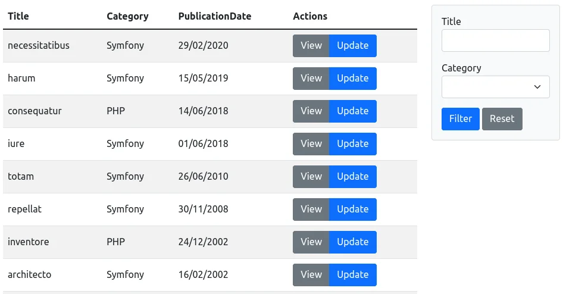
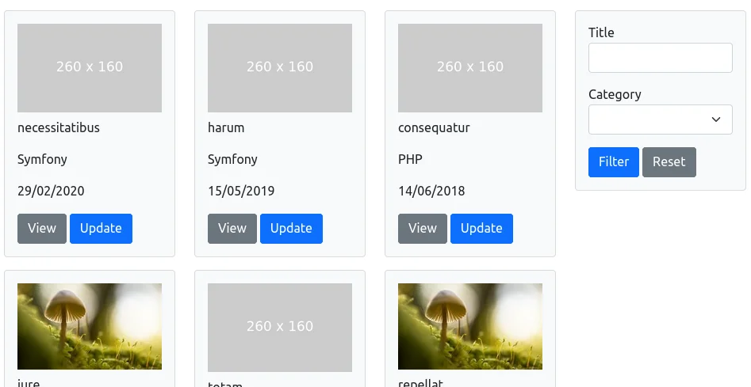

Leapt Core Bundle
=================

[](https://packagist.org/packages/leapt/core-bundle)
[](https://github.com/leapt/core-bundle/actions?query=workflow%3A%22Continuous+Integration%22)
[](https://travis-ci.org/leapt/core-bundle?branch=5.x)
[](LICENSE)
[](https://codecov.io/gh/leapt/core-bundle/branch/5.x)

Introduction
------------

The bundle aims to help with some repetitive tasks, including (but not limited to):

- Data lists with search
- File and image uploads
- Form types
- Navigation helper
- Paginator
- RSS feed generation
- SEO-related tasks (sitemaps, etc)
- Twig extensions
- Utilities
- Validators: PasswordStrength, Recaptcha, Slug

Examples
--------

| Grid layout example | Tiled layout example |
| --- | --- |
|  |  |

| Paginator example | Form types example |
| --- | --- |
|  |  |

Available demo
--------------

If you want to try the bundle before installing it in your own projects, you can 
run this demo project locally: https://github.com/leapt/demo

Installation & usage
--------------------

You can check docs there: https://core-bundle.leapt.dev/

Versions & dependencies
-----------------------

The current version (5.x) of the bundle works with Symfony 6.4 & Symfony 7.0+.
The project follows SemVer.

You can check the [changelog](CHANGELOG-5.x.md) for version 5 and the [upgrade document](UPGRADE-5.x.md) when upgrading
from 4.x bundle version.

| CoreBundle version | Symfony version | PHP version    |
|--------------------|-----------------|----------------|
| 5.x                | ^6.4 \|\| ^7.0  | ^8.2           |
| 4.x                | ^5.4 \|\| ^6.0  | ^8.0           |
| 3.1+               | ^4.4 \|\| ^5.0  | ^7.4 \|\| ^8.0 |
| 3.0                | ^4.4 \|\| ^5.0  | ^7.2           |

Contributing
------------

Feel free to contribute, like sending [pull requests](https://github.com/leapt/core-bundle/pulls) to add features/tests
or [creating issues](https://github.com/leapt/core-bundle/issues) :)

Note there are a few helpers to maintain code quality, that you can run using these commands:

```bash
composer cs:dry # Code style check
composer cs:fix # Fix code style
composer phpstan # Static analysis
composer phpunit # Run tests

# Or run all cs:dry, phpstan & phpunit scripts using the following:
composer ci
```

Docs are built using mkdocs. To launch the docs server locally, run `make docs-start` & open http://127.0.0.1:8000/.

History
-------

This bundle is a maintained fork of the SnowcapCore Bundle: https://github.com/snowcap/SnowcapCoreBundle
