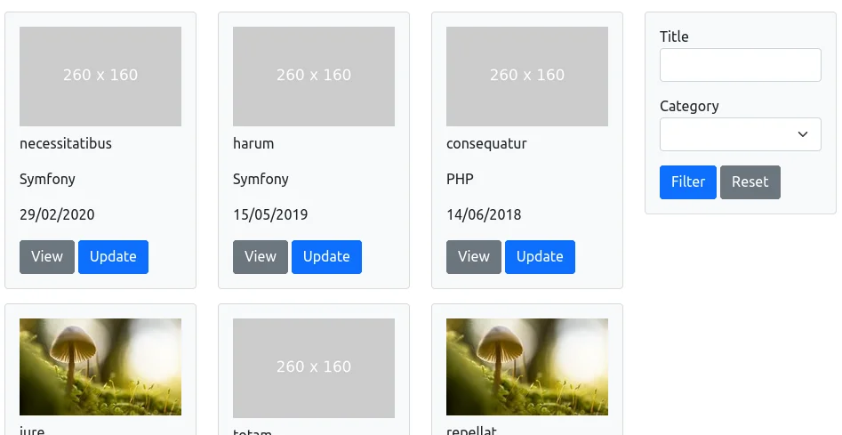

# Data lists

The Datalist component will help you create powerful data lists and lets you:

- Specify a data source (bundle provides datasource handlers for arrays and Doctrine ORM)
- Define all the fields (data) you want
- Create filters to narrow the search
- Paginate automatically (using the [Paginator](paginator.md) defined earlier)

| Grid layout example | Tiled layout example |
| --- | --- |
|  |  |

## Create your first Data list

The following example creates a paginated list of News (10 per page), ordered by descending publication date.

It will display a search filter, two fields (title and publicationDate), and a link to update the news.

??? example "Example"
    ```php
    namespace App\Controller;
    
    use App\Entity\News;
    use App\Repository\NewsRepository;
    use Leapt\CoreBundle\Datalist\Action\Type\SimpleActionType;
    use Leapt\CoreBundle\Datalist\DatalistFactory;
    use Leapt\CoreBundle\Datalist\Datasource\DoctrineORMDatasource;
    use Leapt\CoreBundle\Datalist\Field\Type\DateTimeFieldType;
    use Leapt\CoreBundle\Datalist\Field\Type\TextFieldType;
    use Leapt\CoreBundle\Datalist\Filter\Type\SearchFilterType;
    use Leapt\CoreBundle\Datalist\Type\DatalistType;
    use Symfony\Bundle\FrameworkBundle\Controller\AbstractController;
    use Symfony\Component\HttpFoundation\Request;
    use Symfony\Component\HttpFoundation\Response;
    
    final class NewsController extends AbstractController
    {
        public function __construct(
            private DatalistFactory $datalistFactory,
            private NewsRepository $newsRepository,
        ) {
        }
        
        public function index(Request $request): Response
        {
            $queryBuilder = $this->newsRepository->createQueryBuilder('e')
                ->orderBy('e.publicationDate', 'DESC');
            
            $datalist = $this->datalistFactory->createBuilder(DatalistType::class, [
                    'limit_per_page' => 10,
                    'data_class'     => News::class,
                ])
                ->addField('title', TextFieldType::class, [
                    'label' => 'news.title',
                ])
                ->addField('publicationDate', DateTimeFieldType::class, [
                    'label'  => 'news.publication_date',
                    'format' => 'Y/m/d',
                ])
                ->addFilter('title', SearchFilterType::class, [
                    'label'         => 'news.title',
                    'search_fields' => ['e.title'],
                ])
                ->addAction('update', SimpleActionType::class, [
                    'route'  => 'app_news_update',
                    'label'  => 'content.index.update',
                    'params' => ['id' => 'id'],
                ])
                ->getDatalist();
    
            $datalist->setRoute($request->attributes->get('_route'))
                ->setRouteParams($request->query->all());
            $datasource = new DoctrineORMDatasource($queryBuilder);
            $datalist->setDatasource($datasource);
            $datalist->bind($request);
            
            return $this->render('news/index.html.twig', [
                'datalist' => $datalist,
            ]);
        }
    }
    ```

???+ tip "Tip"
    You can also lighten your controller by [creating a custom Datalist class](data_lists/custom_data_list.md).

## Render the Data list

```twig

    No news available.

    {{ datalist_widget(datalist) }}

```

The data list is built using the `@LeaptCore/Datalist/datalist_grid_layout.html.twig` by default, but you can
of course create your own. Here are the templates provided by the bundle:

- `@LeaptCore/Datalist/datalist_grid_layout.html.twig` (default)
- `@LeaptCore/Datalist/datalist_tiled_layout.html.twig`
- `@LeaptCore/Datalist/datalist_bootstrap3_grid_layout.html.twig`
- `@LeaptCore/Datalist/datalist_bootstrap3_tiled_layout.html.twig`
- `@LeaptCore/Datalist/datalist_bootstrap4_grid_layout.html.twig`
- `@LeaptCore/Datalist/datalist_bootstrap4_tiled_layout.html.twig`
- `@LeaptCore/Datalist/datalist_bootstrap5_grid_layout.html.twig`
- `@LeaptCore/Datalist/datalist_bootstrap5_tiled_layout.html.twig`

And like the Paginator component, you can override it using a Twig tag:

```twig

```

Don't hesitate to create your own to adapt it to your layout/styles.

## Available Field types

Here are the Field Types provided by the bundle. Feel free to check the classes to know the available options.

You can also create your own.

- [BooleanFieldType](https://github.com/leapt/core-bundle/blob/4.x/src/Datalist/Field/Type/BooleanFieldType.php)
- [DateTimeFieldType](https://github.com/leapt/core-bundle/blob/4.x/src/Datalist/Field/Type/DateTimeFieldType.php)
- [HeadingFieldType](https://github.com/leapt/core-bundle/blob/4.x/src/Datalist/Field/Type/HeadingFieldType.php)
- [ImageFieldType](https://github.com/leapt/core-bundle/blob/4.x/src/Datalist/Field/Type/ImageFieldType.php)
- [LabelFieldType](https://github.com/leapt/core-bundle/blob/4.x/src/Datalist/Field/Type/LabelFieldType.php)
- [TextFieldType](https://github.com/leapt/core-bundle/blob/4.x/src/Datalist/Field/Type/TextFieldType.php)
- [UrlFieldType](https://github.com/leapt/core-bundle/blob/4.x/src/Datalist/Field/Type/UrlFieldType.php)

## Available Filter types

Here are the Filter Types provided by the bundle. Feel free to check the classes to know the available options.

You can also create your own.

- [BooleanFilterType](https://github.com/leapt/core-bundle/blob/4.x/src/Datalist/Filter/Type/BooleanFilterType.php)
- [ChoiceFilterType](https://github.com/leapt/core-bundle/blob/4.x/src/Datalist/Filter/Type/ChoiceFilterType.php)
- [EntityFilterType](https://github.com/leapt/core-bundle/blob/4.x/src/Datalist/Filter/Type/EntityFilterType.php)
- [EnumFilterType](https://github.com/leapt/core-bundle/blob/4.x/src/Datalist/Filter/Type/EnumFilterType.php)
- [IsNullFilterType](https://github.com/leapt/core-bundle/blob/4.x/src/Datalist/Filter/Type/IsNullFilterType.php)
- [SearchFilterType](https://github.com/leapt/core-bundle/blob/4.x/src/Datalist/Filter/Type/SearchFilterType.php)

## Available Action types

There is currently one Action Type provided by the bundle: [SimpleActionType](https://github.com/leapt/core-bundle/blob/4.x/src/Datalist/Action/Type/SimpleActionType.php).
Feel free to check the class to know the available options.

You can also create your own.
