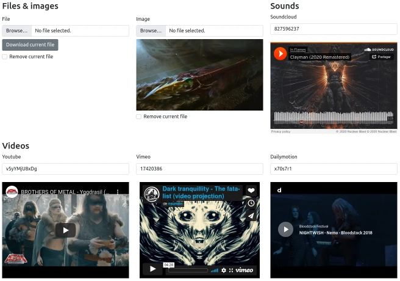

# Form Types

  
*Example of included form types*

## Available form layouts

Since version 4.1.0 of the bundle, there are several form layouts available for the form types provided by the bundle:

- `@LeaptCore/Form/form_layout.html.twig`
- `@LeaptCore/Form/bootstrap_3_layout.html.twig`
- `@LeaptCore/Form/bootstrap_4_layout.html.twig`
- `@LeaptCore/Form/bootstrap_5_layout.html.twig`

If you don't know how to apply a form theme to your forms, [please check Symfony docs about it](https://symfony.com/doc/current/form/form_themes.html).

## File type

!!! example "Usage"

    === "Form"
        ```php
        use Leapt\CoreBundle\Form\Type\FileType;

        public function buildForm(FormBuilderInterface $builder, array $options): void
        {
            $builder->add('file', FileType::class, [
                'label'        => 'press_radio_spot.field.file',
                'file_path'    => 'path', // Required, see Options
                'allow_delete' => true,
                'file_label'   => 'file_type.label',
            ]);
        }
        ```

    === "Model / Entity"
        ```php
        use Leapt\CoreBundle\Doctrine\Mapping as LeaptCore;
        
        class News
        {
            #[ORM\Column(type: 'string')]
            private ?string $image = null;
    
            #[LeaptCore\File(path: 'uploads/news', mappedBy: 'image')]
            private ?UploadedFile $file = null;
        }
        ```

??? info "Options"

    | Name | Description | Default value |
    | ---- | ----------- | ------------- |
    | file_path (required) | Property of the object that stores the file path. Used to display a download link. Can be a string, or a callback to generate the link. The callback gets the entire object as an argument. | |
    | delete_label | Text to display next to the delete checkbox. | Delete |
    | download_label | Text to display in the download link. | Download |
    | allow_delete | Display a checkbox that allows to remove the current file. | true |
    | allow_download | Display a link to download the file. | true |

See also [File uploads](file_uploads.md).

## Image type

To be updated soon.
See also [File uploads](file_uploads.md).

## Recaptcha type

This form type is based on the [EWZRecaptchaBundle](https://github.com/excelwebzone/EWZRecaptchaBundle/), and allows you 
to generate a Recaptcha V2 in your form, and validate it.

!!! example "Usage"
    ```php
    use Leapt\CoreBundle\Form\Type\RecaptchaType;
    use Leapt\CoreBundle\Validator\Constraints as LeaptCore;
    use Symfony\Component\Form\AbstractType;
    use Symfony\Component\Form\FormBuilderInterface;

    final class ContactType extends AbstractType
    {
        public function buildForm(FormBuilderInterface $builder, array $options)
        {
            $builder->add('recaptcha', RecaptchaType::class, [
                'label' => false,
                'constraints' => new LeaptCore\Recaptcha(), // You can also set the constraint in your model
            ]);
        }
    }
    ```

!!! info "Layout"
    Use/extend the `@LeaptCore/Form/form_core_layout.html.twig`, or add it to your Twig's `form_themes` configuration, 
    so the field is rendered properly.

!!! info "Configuration"
    ```yaml
    # config/packages/leapt_core.yaml
    leapt_core:
        recaptcha:
            public_key:  'your_public_key'
            private_key: 'your_private_key'
            enabled: true # true by default, but you can set it to false for your tests
    ```

## RecaptchaV3 type

This form type is based on the [EWZRecaptchaBundle](https://github.com/excelwebzone/EWZRecaptchaBundle/), and allows you 
to generate a Recaptcha V3 in your form, and validate it.

It requires you to have the `google/recaptcha` package installed in your application. If it is not installed, a clear
error message should be displayed in debug mode when validating.

!!! example "Usage"
    ```php
    use Leapt\CoreBundle\Form\Type\RecaptchaV3Type;
    use Leapt\CoreBundle\Validator\Constraints as LeaptCore;
    use Symfony\Component\Form\AbstractType;
    use Symfony\Component\Form\FormBuilderInterface;

    final class ContactType extends AbstractType
    {
        public function buildForm(FormBuilderInterface $builder, array $options)
        {
            $builder->add('recaptcha', RecaptchaV3Type::class, [
                'label' => false,
                'constraints' => new LeaptCore\RecaptchaV3(), // You can also set the constraint in your model
            ]);
        }
    }
    ```

!!! info "Layout"
    Use/extend the `@LeaptCore/Form/form_core_layout.html.twig`, or add it to your Twig's `form_themes` configuration, 
    so the field is rendered properly.

!!! info "Configuration"
    ```yaml
    # config/packages/leapt_core.yaml
    leapt_core:
        recaptcha:
            public_key:  'your_public_key'
            private_key: 'your_private_key'
            enabled: true # true by default, but you can set it to false for your tests
            hide_badge: true # false by default
    ```

## Sound type

Provides a text field where the user enters a code matching an item available on a Sound platform.
When the value is filled when rendering the form, it will display a player.

!!! example "Usage"
    ```php
    use Leapt\CoreBundle\Form\Type\SoundType;

    public function buildForm(FormBuilderInterface $builder, array $options): void
    {
        $builder->add('sound', SoundType::class, [
            'provider' => SoundType::PROVIDER_SOUNDCLOUD,
        ]);
    }
    ```

??? info "Options"

    | Name | Description | Default value |
    | ---- | ----------- | ------------- |
    | provider (required) | Which provider should be used to render the player. Values available as constants on SoundType (currently available: "soundcloud") | |
    | player_width | Width of the player to display, can be either an int or a string. | 560 |
    | player_height | Height of the player to display, can be either an int or a string. | 300 |

## Video type

Provides a text field where the user enters a code matching an item available on a Video platform.
When the value is filled when rendering the form, it will display a player.

!!! example "Usage"
    ```php
    use Leapt\CoreBundle\Form\Type\VideoType;

    public function buildForm(FormBuilderInterface $builder, array $options): void
    {
        $builder->add('video', VideoType::class, [
            'provider' => VideoType::PROVIDER_YOUTUBE,
        ]);
    }
    ```

??? info "Options"

    | Name | Description | Default value |
    | ---- | ----------- | ------------- |
    | provider (required) | Which provider should be used to render the player. Values available as constants on VideoType (currently available: "youtube", "tudou", "vimeo", "dailymotion") | |
    | player_width | Width of the player to display, can be either an int or a string. | 560 |
    | player_height | Height of the player to display, can be either an int or a string. | 300 |
